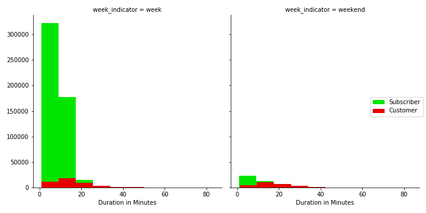
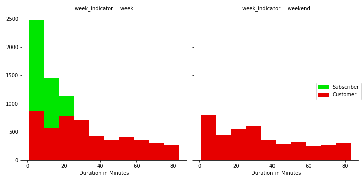

# Bay Area Bike Share System

## Preliminary Comments

The California Bike Share station network is highly discontinuous and extends along the bay area in five districts, where the stations are highly clustered in areas of a few square km. Taking into account the typical intra-district length of the trips (a few kilometers and less than 20 minutes). San Francisco and San Jose can be treated as isolated networks and the central corridor (Redwood, Palo Alto and Mountain View) as a third one.
The net activity is highly variable among these districts, being San Francisco the prevalent zone of activity; certain stations focus a significant fraction of the activity of each district.
The daily net activity is markedly higher during working days, registering two peaks at work-commuting hours (8 am and 5 pm). 
The season affects both the total activity and the daily activity profile.
The behavior of the clients,customers and subscriber is markedly different during the week days and almost identical during the weekends. Customers pay by ride use whereas subscribers pay an year long subscription.

The following study evaluates the incidence of variables including spatial (network size, station distribution and trip distances), temporal (season, day of the week, hour of the day) and meteorological (temperature, precipitations).
 
### Figure 1. Geographic distribution of stations in the network

The whole station network is distributed in five different districts (from north to south: San Francisco, Redwood, Palo Alto, Mountain View and San Jose) placed along the bay area. San Francisco and San Jose districts show densely clustered stations are in areas of a few square km. In each case, these clusters are separated from the nearest set of stations by more than 16 km (10 miles) and be considered isolated sub-networks. In contrast, the stations belonging to the remnant districts (Redwood, Palo Alto and Mountain View) are more continuously distributed in a common corridor, with some station-absent zones of a few miles. The proximity between these districts suggest that they can be considered a single cluster.

### Figure 2. Geographic distribution of started trips by station

If the number of total trips initiated in each station (net activity) is plotted in the same map, it can be clearly noticed that San Francisco district accounts for a markedly higher total activity (four-fold) than any other district. The central corridor Redwood-Palo Alto-Mountain View accounts for the lowest activity.

### Figure 3. Distribution of the duration in minutes of all trips in the network

As we can see from the distribution graph, the majority of trips take a duration of around 10 minutes, the distribution is
highly skewed and asymmetric to the right with very few trips lasting around one hour.Outliers can be registered for trips lasting up to 80 minutes.

### Figure 4. Distribution of the distances in km for all trips.

Among the total trips, the net distance between starting and ending station, depicts an analogous distribution as the trip duration, with a prevalence of trips shorter than 3 km an almost no trips longer than 10 km. Few outliers can be registered for trips demanding up to 50 km. For visualization purposes, the distribution shown is capped at 20km. Complete distribution can be shown in the jupyter notebook.

### Figure 5. Total Trips by Day of the Week

Concerning the total activity distribution along the week, it is opportune to discriminate the clients as customers and subscribers, according to the type of their contract. The majority of the trips occur during the week, where the activity of subscribers is almost ten-fold higher than that of customers. During the weekend this activity decays and converges to the typical values of customers.
 

 

### Figure 6. Total Trips by Month 

If the former analysis is repeated along the year, the total trips are slightly incremented during summer months, reaching minimum values at December. Subscribers are impacted with a reduction of 40% whereas customers reduction in activity is around 30%.

### Figure 7. Total Trips per Hour

Along working days, the total trips per hour shows a marked difference between customers and subscribers. Subscribers register two activity peaks, linked to working hours (commuting from work), while customers have a more equally distributed behaviour along the day. In agreement with previous information, during the weekend the behaviour of these clients is almost identical to customers’ one.

### Figure 8. Not equal start and end stations. 

It can be argued that the customers that take a bike in one station to end the trip in a different station may show different behaviour from those that end the trip in the same station as it was started (no displacement vs net displacement). An additional separation between subscribers and occasional customers shows interesting patterns to take into consideration. Over the week, we can hypothesize that the subscribers that start and end in a different station are those that go to work on a defined schedule. They show a marked difference from occasional customers, difference that vanishes over the weekend.

Net displacements markedly prevail over round trips, irrespective of the client type.

### Figure 9. Equal start and end stations

### Figure 10. Number of Trips started por city, showed in logarithmic scale

For each one of the main districts, the total amount of customer’s trips remains invariant from week to weekend days. Subscribers dominate the activity in each district during the week while during the weekend, their activity decays to the values exhibited by customers or even lower.

### Figure 11. Heatmap San Francisco

The total activity heatmap of San Francisco reveals that during the week, certain stations prevail over the rest, either in the case of customers and subscribers. However, their location is different depending on the client type. During the weekend these differences between clients fade and the location of hot spots changes, driven by the prevalent activity of customers.

### Figure 12. Heatmap Mountain View

Mountain View district depicts a similar behavior as San Francisco

### Figure 13. Impact of Weather on activity during the Week

### Figure 14. Impact of Weather on activity during the weekend

### Figure 15. Hour impact by season, December

During working days, subscriber’s peak activity remains defined at the same hours of the day; in summer, these peaks are markedly incremented; customers activity behaves more constantly.
During the weekends both type of clients behaves similar independently of the season. However, their maximum activity decays from 3 pm to 6 pm in winter instead of the smoother decay (from 2 pm to 9 pm) observed in summer.

### Figure 16. Hour impact by season, June

